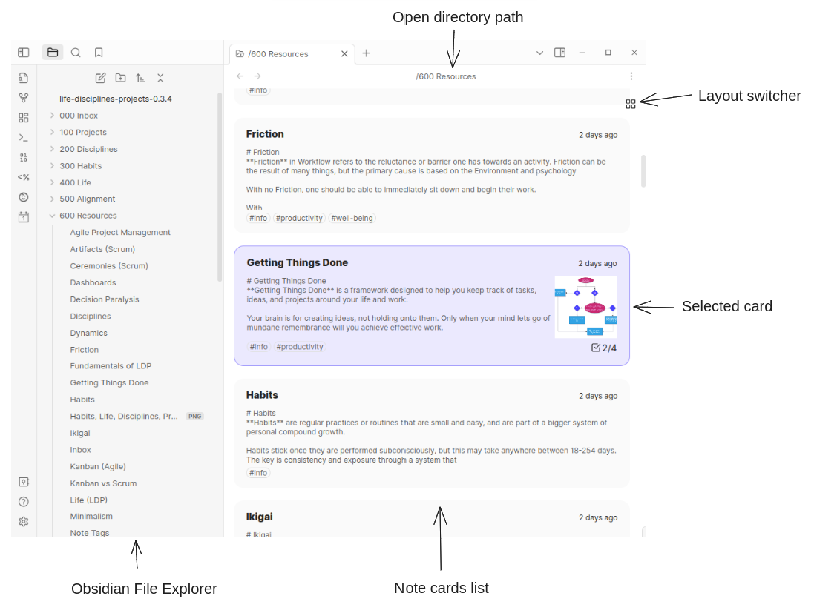
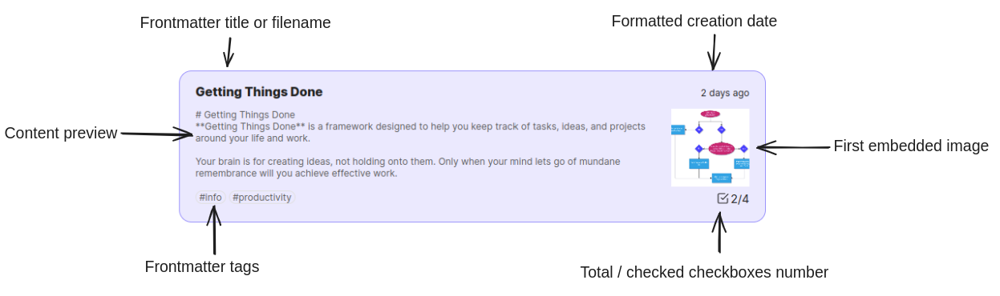

# Belyalov Commander

Note preview and management [Obsidian](https://obsidian.md/) plugin

## Description

## Installation

- `Belyalov Commander` is not available on [the official Community Plugins repository](https://obsidian.md/plugins) yet.
- Beta releases can be installed through [BRAT](https://github.com/TfTHacker/obsidian42-brat)

## Usage

### Explore directory by notes previews

- Ctrl-clicking on a directory in the file explorer opens the plugin view with a list of note cards.

https://github.com/theotheo/belyalov-commander/assets/1499744/749c0fb5-1266-46d5-8a53-6c9fe10daf4c

### Open notes in a new side-pane

- Clicking on a note card will open the note, either in a tab on the side pane  if it exists, or in a new tab.
- Ctrl-clicking a note card opens it in a new side panel

https://github.com/theotheo/belyalov-commander/assets/1499744/aa17ce44-bbe8-461d-ada3-e9095de6efad

### Move notes by dragging and dropping them to the Obsidian file manager

- Shift-clicking selects a card
- Dragging a card or the selected cards on the file explorer moves them into a appropriate directory

https://github.com/theotheo/belyalov-commander/assets/1499744/912cf5e1-d938-4130-a7f1-12b05ea2bee0

### Switch between a list and grid layout

- Clicking on the grid icons switches between a list and grid layout 

https://github.com/theotheo/belyalov-commander/assets/1499744/46da5f28-17a3-40cb-b882-0e6d59c35063

## Roadmap

- Ability to open multiple tabs at the same time
- Transfer files to a directory via drop on the plugin view
- Switching routing options
- Filtering the last by searching by substring
- Mode for displaying a list for all notes
- The mood for displaying recently changed notes
- Selecting a list of files with the mouse
- Adding directories in the card list

## Acknowledgements

- [LeeSoftRu](https://github.com/LeeSoftRu) for inspiration
- [mnaovov](https://github.com/mnaoumov) for his help with the initial steps of programming for Obsidian and [plugin generator](https://github.com/mnaoumov/generator-obsidian-plugin)
- [alx-folder-note](https://github.com/aidenlx/alx-folder-note ) for an example of File Explorer monkey-patching 
- [obsidian-full-calendar](https://github.com/davish/obsidian-full-calendar ) for an example of how to write tests and mocks for Obsidian
- [Life-Disciplines-Projects](https://github.com/uwidev/life-disciplines-projects) for the vault that I use in the demos
- [Russian-speaking Obsidian community](https://t.me/obsidian_z) for meaningful conversations

## License

 © [ibelyalov](https://github.com/theotheo/)
